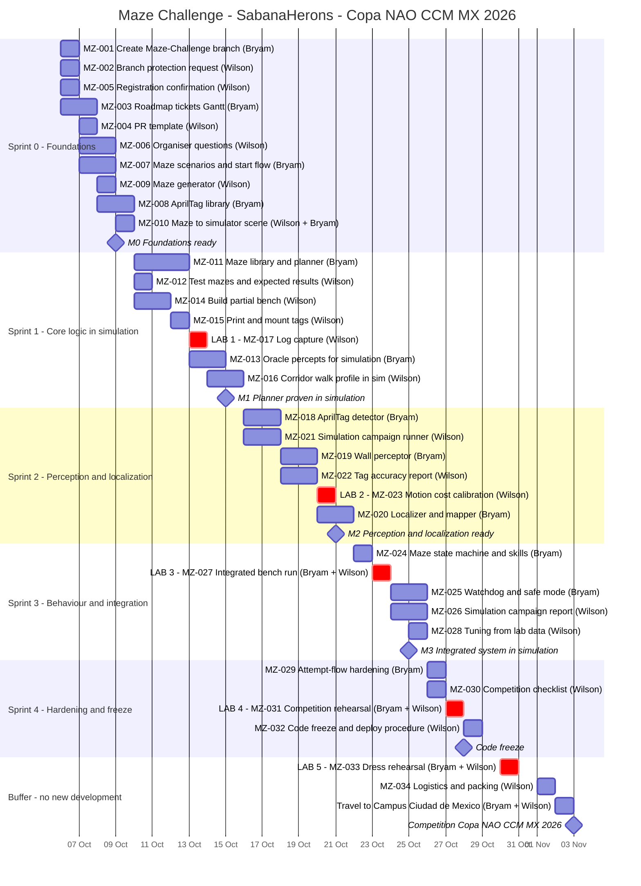

# Maze Challenge Schedule and Lab Access Request — Copa NAO CCM MX 2026

SabanaHerons develops the autonomous maze solver for the NAO v6 between **6 and 28 October
2026**. The competition is on **3 November 2026** at Tec de Monterrey, Campus Ciudad de México.
Most of the work happens in simulation and on recorded data. The physical robot and the lab are
needed for only **5 short sessions (11 hours in total)**. Those sessions are highlighted in the
chart and itemised in the lab access request below.

Related: [ROADMAP_LABERINTO.md](ROADMAP_LABERINTO.md) · [TICKETS_LABERINTO.md](TICKETS_LABERINTO.md)

---

## Gantt chart

### Legend

| Style in the chart | Meaning |
|---|---|
| **Red bar** (`crit`), name starts with **LAB** | Needs the lab and the physical NAO robot |
| Normal bar | Desk work: development, simulation, recorded logs, scripts, documentation |
| Diamond | Milestone: end of a sprint, code freeze, competition |
| Name in parentheses | Person responsible (Bryam, Wilson, or both when pairing) |

**At a glance**

- 5 of 34 tickets need the lab.
- 11 hours of lab time out of 95 hours of total effort (Bryam 50 h, Wilson 45 h).

| Sprint | Dates | Milestone |
|---|---|---|
| Sprint 0 — Foundations | 6–9 Oct | M0 (9 Oct) |
| Sprint 1 — Core logic in simulation | 10–15 Oct | M1 (15 Oct) |
| Sprint 2 — Perception and localization | 16–21 Oct | M2 (21 Oct) |
| Sprint 3 — Behaviour and integration | 22–25 Oct | M3 (25 Oct) |
| Sprint 4 — Hardening and freeze | 26–28 Oct | Code freeze (28 Oct) |
| Buffer — rehearsal and travel | 29 Oct – 2 Nov | Competition (3 Nov) |

---

## Lab access request

**To:** University lab management
**From:** SabanaHerons robotics team (Bryam, Wilson)
**Purpose:** preparation for the Maze category of the Copa NAO CCM MX 2026 (3 Nov 2026, Tec de Monterrey, Campus Ciudad de México)

### Requested sessions

| # | Date | Duration | Objective | What is tested | People |
|---|---|---|---|---|---|
| 1 | Tue 13 Oct 2026 | 2 h | Record real camera and motion data | AprilTag markers seen by the robot's camera at 0.25–2 m and 0–60°; robot standing in a corridor of the test bench | 1 |
| 2 | Tue 20 Oct 2026 | 2 h | Calibrate motion on the real floor | Time and precision of steps and turns (10 repetitions each); live marker recognition under the lab's lighting | 1 |
| 3 | Fri 23 Oct 2026 | 2.5 h | First run of the full software between real walls | Corridor, corner, T-junction and dead end on the partial bench: wall clearance, wall contacts, decisions | 2 |
| 4 | Tue 27 Oct 2026 | 2.5 h | Competition-mode rehearsal | Complete two-attempt procedure and the timed 5-minute calibration drill | 2 |
| 5 | Fri 30 Oct 2026 | 2 h | Dress rehearsal with the final software | Full competition checklist from start to finish, no changes allowed | 2 |
| | | **11 h total** | | | |

Four of the five sessions fall in the second half of October, when the software is mature
enough to benefit from real-world testing.

### Space

| | Size | Use |
|---|---|---|
| **Minimum** | **2.5 m × 2 m** of clear, flat floor | A partial test bench of 2×3 cells (1 m × 1.5 m) built from 6 free-standing panels, plus a 1 m straight line for calibration and a safety margin around the robot |
| **Ideal (if available)** | **4 m × 4 m plus 0.5 m margin per side (5 m × 5 m)** | The footprint of the full competition maze (8×8 cells of 50 cm), should we be able to build more panels later |
| Floor | Uniform, matte, hard (no thick carpet) | Similar to the competition floor |
| Storage (if possible) | Space for 6 panels of 50 × 60 cm between sessions | Avoids rebuilding the bench each time |

### Equipment

| Item | Provided by |
|---|---|
| NAO v6 robot, charger and spare battery | Team / university robotics inventory |
| Ethernet cable (robot ↔ laptop) and laptop with the development environment | Team |
| Printer access for the AprilTag markers (matte paper, A4 or letter, black and white) | University |
| Test-bench materials: 6 foam-board or MDF panels (50 × 60 cm, 1–2 cm thick), supports or clamps, floor tape | Team |
| Tape measure, ruler, protractor | Team |
| Wall power outlet near the bench | Lab |

### Justification

The competition maze is 4 × 4 m with 64 cells, and we cannot build it before the event. Our plan
does not depend on it.

- **Simulation and recorded data first.** Most development runs in the B-Human robot simulator and on recorded robot data: the route planner, the map memory between the two attempts, the decision logic and the safety watchdog. These are tested on dozens of generated mazes without using the robot or the lab.
- **The lab only for what cannot be simulated.** The lab is requested only to validate what the simulator cannot reproduce faithfully:
  - the real camera and real marker recognition under real lighting;
  - the precision of steps and turns on a real floor;
  - the robot's clearance when walking between real walls (corridors are about 48 cm wide for a 27.5 cm wide robot).
- **A small partial bench.** A cheap bench of 6 panels covers every situation a maze can present: a corridor, a corner, a T-junction and a dead end.
- **Short, focused sessions.** Five sessions of 2–2.5 hours (11 h in total) keep the use of the robot and the space to a minimum.
