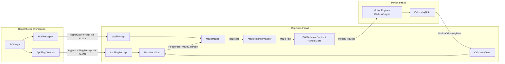
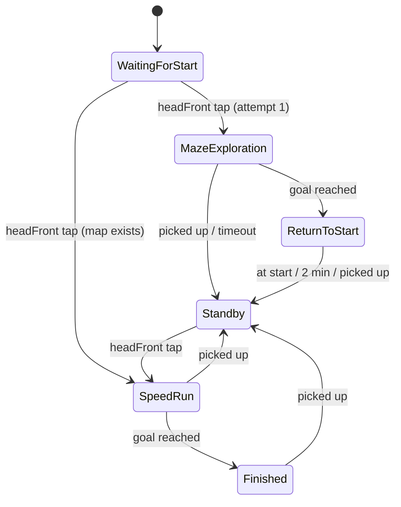

# Maze Challenge Roadmap — Copa NAO CCM MX 2026

SabanaHerons will solve the **Maze category (Rules §3.1)** with a NAO v6 running this B-Human 2023
fork. The robot explores an unknown 8×8 maze in attempt 1, keeps the map in process memory, and
runs the fastest known route in attempt 2. Development runs **6–28 Oct 2026**. The code freezes
on **28 Oct**, and the competition is on **3 Nov 2026** (9:00–15:00, Tec de Monterrey, Campus
Ciudad de México).

| Companion document | Content |
|---|---|
| [TICKETS_LABERINTO.md](TICKETS_LABERINTO.md) | Every ticket (MZ-001 … MZ-034, plus backlog MZ-035), owners, estimates, branches and acceptance criteria |
| [GANTT_LABERINTO.md](GANTT_LABERINTO.md) | Gantt chart and the lab access request for the university |

---

## 1. Quick path

1. **Sprint 0 (6–9 Oct):** create `Maze-Challenge` and the PR flow, the `Maze`/`MazeSafe` scenarios, the apriltag library, the maze generator and the simulator scene.
2. **Sprint 1 (10–15 Oct):** build the maze library, the time-weighted planner and the oracle percepts in simulation. Build the partial bench, print the tags, and record logs in Lab 1.
3. **Sprint 2 (16–21 Oct):** add the AprilTag detector, the wall perceptor, the localizer and the mapper, validated offline. Calibrate turn and step costs in Lab 2.
4. **Sprint 3 (22–25 Oct):** build the competition state machine, the watchdog and the safe mode. Run the simulation campaign, then the integrated bench run in Lab 3.
5. **Sprint 4 (26–28 Oct):** harden the attempt flow, write the checklist and the 5-minute calibration procedure, rehearse in Lab 4, and **freeze the code**.
6. **Buffer (29 Oct–2 Nov):** dress rehearsal in Lab 5 and logistics only. **No new development.**

Budget: **Bryam 50 h**, **Wilson 45 h**, including lab sessions and cross-review. Only 5 short lab
sessions (11 h of room time) are needed. Everything else runs in simulation or on recorded logs.

---

## 2. Rule constraints that drive the design

Source: *Reglamento Copa NAO CCM MX 2026 V1.0*, §2.7, §2.10 and §3.1.

| Rule | Value | Design consequence |
|---|---|---|
| Grid | 64 cells, 8×8, each 50×50 cm | The map is 8×8 cells with 4 edges per cell (`MazeMap`) |
| Walls | ≥60 cm high, **1–2 cm thick**, light colour; matte uniform floor | Corridor is ≈48–49 cm wide. With a 275 mm NAO, the **clearance is ≈10.3–10.8 cm per side** (the often-quoted 11.25 cm ignores wall thickness). Arm swing and turning sweep reduce it further. |
| Start | Corner cell, walls on 3 sides | Start cell ∈ {0, 7, 56, 63}. The heading is the only open side. |
| Goal | Distinct floor colour, no internal walls in its cell | Goal detection is floor colour plus map position |
| AprilTags | `tag36h11`, 15×15 cm, "at the centre of the walls" of every cell | `id = row * 8 + col`, with 0 at top-left, row-major. **Which walls carry tags, and at what height, is not specified** (open question Q1). |
| Score | `Tfinal = 0.3·T1 + 0.7·T2` (seconds) | Attempt 2 dominates. Spend attempt-1 time on map quality. |
| Wall knocked or moved | +10 s per event, cumulative, added before the formula | +10 s is about 4 cells of walking. **Slow and clean beats fast and touching.** |
| Attempt timeout | Set by organisers (normally 3–5 min) | If not finished: T = Tmax, and the team is ranked by shortest-path distance to the goal |
| Robot stops >5 s "without apparent reason" | The judge *may* end the attempt | Hard watchdog: never let the robot stand still for more than 3 s |
| Memory between attempts | Robot may stay on and keep the map. Manual changes are forbidden. | The map lives in process memory (`MazeMapper` member state) |
| Manual map entry before run 1 | Disqualification | No map files are deployed, and there is no USB or network input |
| Return to start after an attempt | Allowed, ≤2 min, may be used to keep exploring | Stretch goal: explore promising unknown cells on the way back |
| Activation | On-robot sensor only, ≤10 s after the whistle | Single `headFront` tap |
| Communication | No Wi-Fi at any time. Upload by Ethernet before participating. | Deploy with `-w NONE`. Checklist verifies Wi-Fi is off. |
| Calibration zone (§2.10) | ≤5 min per test, track may differ, no guaranteed slot | Defaults must work **without** on-site calibration |

**Score intuition.** Suppose exploration takes 180 s and the speed run takes 60 s. Then
`0.3·180 + 0.7·60 = 96 s`. One wall touch in attempt 2 costs `0.7·10 = 7 s`, as much as shaving
23 s off exploration. Robustness in attempt 2 is the priority.

---

## 3. Audit of the fork (what we build on)

All paths are relative to the repo root and were verified on `master` (commit `2360ab11`).

### 3.1 Threads and data flow

| Topic | Finding | Path |
|---|---|---|
| Thread declaration | Per scenario: `Upper`, `Lower` (execution unit `Perception`), `Cognition`, `Motion`, `Audio`, `Referee` | `Config/Scenarios/<scenario>/threads.cfg` |
| Cross-thread sharing | Automatic. A `REQUIRES(X)` whose provider runs in another thread is streamed from that thread. `USES(X)` is same-thread only. | `Src/Libs/Framework/ModuleGraphCreator.cpp` (`calcShared`) |
| Cognition ↔ Motion | Cognition provides `MotionRequest` (`SkillBehaviorControl`). Motion provides `OdometryData`, which Cognition re-exposes through `MotionProvider` (`MotionOdometryData` → `OdometryData`). | `Src/Modules/Infrastructure/InterThreadProviders/MotionProvider.h` |
| Upper/Lower → Cognition | `DECLARE`/`SELECTS`/`ALIAS` macros create `UpperX`/`LowerX` aliases and a `PerceptionXProvider` in Cognition | `Src/Modules/Infrastructure/InterThreadProviders/PerceptionProviders.{h,cpp}` |
| Images in Cognition | **No full `CameraImage`** in Cognition (only `OptionalECImage`), so tag detection must run in the Upper/Lower threads | `Src/Representations/Perception/ImagePreprocessing/ECImage.h` |
| Camera resolution | Upper 640×480, lower 320×240 | `Config/Robots/Default/cameraResolution.cfg` |
| Projection helpers | `imageToRobot`, `imageToRobotHorizontalPlane`, `robotToImage` | `Src/Tools/Math/Transformation.h` |

### 3.2 Module framework

| Macro | Where | Note |
|---|---|---|
| `MODULE`, `REQUIRES`, `USES`, `PROVIDES`, `DEFINES_PARAMETERS`, `LOADS_PARAMETERS`, `MAKE_MODULE` | `Src/Libs/Framework/Module.h` | `LOADS_PARAMETERS` reads `<lowerCamelModuleName>.cfg` through the config search path |
| `STREAMABLE`, `STREAMABLE_WITH_BASE` | `Src/Libs/Streaming/AutoStreamable.h` | Small example: `Src/Representations/MotionControl/OdometryData.h` |
| Provider selection | `{representation = X; provider = Y;}` per thread in `threads.cfg` | A representation in `defaultRepresentations` must not also have a provider |
| Message IDs (optional, for logging) | `Src/Libs/Streaming/MessageIDs.h` | Without an ID, the debug output of the module is skipped |
| Source collection | `Src/Modules/**/*.cpp`, `Src/Tools/**/*.cpp` and similar are globbed (`CONFIGURE_DEPENDS`) | `Make/CMake/B-Human.cmake` |

### 3.3 Behaviour control (CABSL)

| Topic | Finding | Path |
|---|---|---|
| Entry point | `SkillBehaviorControl` provides `MotionRequest`, `HeadMotionRequest`, `ArmMotionRequest` and `BehaviorStatus` | `Src/Modules/BehaviorControl/SkillBehaviorControl/SkillBehaviorControl.{h,cpp}` |
| Root option | `PlaySoccer` = `select_option(options)` | `Src/Modules/BehaviorControl/SkillBehaviorControl/Options/PlaySoccer.h` |
| Option list | `options = [...]` per scenario | `Config/Scenarios/<scenario>/skillBehaviorControl.cfg` |
| New option | `#include` at the bottom of `SkillBehaviorControl.h` plus an entry in the `.cfg` | — |
| CABSL | `option`, `initial_state`, `state`, `transition`, `action`, `goto`, `state_time` | `Src/Tools/Cabsl.h`, `Src/Tools/BehaviorControl/Framework/Skill/CabslSkill.h` |
| Skills | `SKILL_INTERFACE` + `SKILL_IMPLEMENTATION` / `MAKE_SKILL_IMPLEMENTATION` | `Src/Representations/BehaviorControl/SkillInterfaces.h`. Templates: `Skills/Demo/DemoWave.cpp` (button-driven CABSL), `Skills/Output/MotionRequest/Stand.cpp` |
| Cards | **Not present in this fork** | — |

### 3.4 Start signal and buttons

| Fact | Path |
|---|---|
| Without a GameController, the chest button cycles: tap 1 = wake (Initial, stand), tap 2 = penalized, tap 3 = playing | `Src/Modules/Infrastructure/GameStateProvider/GameStateProvider.cpp` |
| `EnhancedKeyStates.hitStreak[key]` is non-zero for one frame about 200 ms after the last release | `Src/Modules/Sensing/KeyStateEnhancer/KeyStateEnhancer.cpp` |
| Triple head taps are used by diagnostics, so **a single `headFront` tap is free** | `Src/Modules/BehaviorControl/SkillBehaviorControl/SkillBehaviorControl.cpp` (≈ lines 178–203) |
| Holding all 3 head buttons for 1 s makes the robot unstiff. Holding the chest for 3 s shuts the process down (map lost). | `Config/Scenarios/Default/gameStateProvider.cfg`, `Src/Modules/Infrastructure/NaoProvider/NaoProvider.cpp:324-336` |
| **Logger only records when GameState is not Initial** | `Src/Tools/Framework/BHLoggingController.cpp:33` |

**Consequence.** Before the whistle, the operator brings the robot to *playing* with three chest
taps (it stands still in `WaitingForStart`). The run then starts with one `headFront` tap. This
keeps logging active and avoids every conflicting gesture.

### 3.5 Localization and sensing

| Topic | Finding | Path |
|---|---|---|
| Self-localization | `SelfLocator` (particle filter + UKF) needs field features (lines, circle, penalty marks). **It is useless in a maze.** | `Src/Modules/Modeling/SelfLocator/` |
| Pose representation | `RobotPose : Pose2f` (mm, rad) with `quality` and `covariance` | `Src/Representations/Modeling/RobotPose.h` |
| Odometry | `OdometryData : Pose2f`, provided in Motion | `Src/Representations/MotionControl/OdometryData.h` |
| Oracle pose in simulation | `OracledWorldModelProvider` (ground truth) | `Src/Modules/Modeling/OracledWorldModelProvider/` |
| Sonar | **Not implemented.** LoLA "Sonar" is ignored. | `Src/Modules/Infrastructure/NaoProvider/NaoProvider.cpp:408` |

### 3.6 Walking

Config search order (`Src/Libs/Framework/Settings.cpp:58-73`) checks `Config/Scenarios/<scn>/`
**before** `Config/Robots/Default/`. So maze-specific walk overrides go in
`Config/Scenarios/Maze/` and the soccer setup stays untouched.

| Parameter | Default | File |
|---|---|---|
| `maxSpeed` (rotation, x, y) | 120°/s, 250 mm/s, 200 mm/s | `Config/Robots/Default/walkingEngine.cfg` |
| `armParameters.armShoulderRoll` / `armShoulderRollIncreaseFactor` / `armShoulderPitchFactor` | 7°, 2, 6 | `Config/Robots/Default/walkingEngineCommon.cfg` |
| `kinematicParameters.sidewaysHipShiftFactor`, `torsoOffset` | 0.53, 12 mm (forward) | `walkingEngineCommon.cfg` |
| `sideStabilizeParameters.*`, `balanceParameters.gyroSidewaysBalanceFactor` | see file | `walkingEngineCommon.cfg` |
| Arms-on-back keyframe | `ArmKeyFrameRequest::back` | `Config/Robots/Default/armKeyFrameEngine.cfg`, skill `KeyFrameArms` |

Motion requests without field dependency: the `WalkToPose` skill (empty obstacle avoidance) and
`WalkAtRelativeSpeed`. `PathPlannerProvider` and `WalkToPoint` depend on the soccer field and
are **not** used.

### 3.7 Build, deploy and process lifetime

| Topic | Finding |
|---|---|
| Languages | The project is `LANGUAGES CXX` (`CMakeLists.txt`, `Make/CMake/CMakeLists.txt`) |
| Third-party C libraries | libjpeg, snappy and fftw are **prebuilt static libraries** imported in `Make/CMake/CMakeLists.txt` (`lib/V6/*.a` for the NAO, `lib/Linux/*.a` for desktop) and linked in `Make/CMake/B-Human.cmake` |
| Build | `Make/Linux/compile Develop Nao`, `Make/Linux/compile Develop SimRobot`, `Make/Linux/compile Develop Tests` |
| Unit tests | gtest, desktop only, `Src/Apps/Tests/**` globbed by `Make/CMake/Tests.cmake` |
| Deploy | `Make/Common/deploy Develop <ip> -s <scenario> -l <location> -w <profile> -b`. Wireless profile `NONE` exists in `Install/Profiles/`. |
| Process lifetime | The map in memory survives falls and short button taps. It is **lost** on crash (`Src/Apps/Nao/Main.cpp` never respawns), on a 3 s chest hold, and on redeploy. |
| Simulator | RoSi2 scenes in `Config/Scenes/*.ros2`. Walls are `BoxGeometry` (see `Config/Scenes/Includes/Field2020SPL.rsi2`). Log replay: `Config/Scenes/ReplayRobot.ros2`. Headless SimRobot via `pybh` (`docs/RL/Environment.md`). |

**Canonical way to add `apriltag`:** follow the libjpeg pattern. Vendor the sources and a build
script in `Util/apriltag/`, commit `lib/V6/libapriltag.a` (built with the V6 buildchain,
`-march=silvermont`) and `lib/Linux/libapriltag.a` (PIC), then declare imported targets
`Nao::apriltag::apriltag` / `apriltag::apriltag` in `Make/CMake/CMakeLists.txt`. Link them in both
branches of `Make/CMake/B-Human.cmake`.

*Alternative (not chosen):* compile from source like `Make/CMake/asmjit.cmake`. That needs
`LANGUAGES C CXX`, a C compiler in `Make/CMake/NaoToolchain.cmake`, and preset changes, which is
more build-system risk in a 3-week window.

---

## 4. Architecture

### 4.1 Overview



### 4.2 New scenarios

| Scenario | Purpose |
|---|---|
| `Config/Scenarios/Maze/` | Competition profile. Derived from `Config/Scenarios/AnyPlaceDemo/`. Ball, YOLO, team-communication and soccer modules are removed to free CPU. `RobotPose` is removed from `defaultRepresentations` and provided by `MazeLocalizer`. |
| `Config/Scenarios/MazeSafe/` | Same modules with conservative motion parameters (lower speed, wider safety margin, slower turns). Fallback deploy if on-site calibration looks bad. |

### 4.3 Representations (new)

| Representation | Content | Path |
|---|---|---|
| `AprilTagPercept` | List of detections: `id`, image corners, `Pose3f` tag-in-robot, decision margin, timestamp | `Src/Representations/Perception/MazePercepts/AprilTagPercept.h` |
| `WallPercept` | Wall segments robot-relative (mm), plus a per-direction (front/left/right) wall distance estimate | `Src/Representations/Perception/MazePercepts/WallPercept.h` |
| `MazeMap` | 8×8 cells. Edge state `unknown/open/wall` with evidence counters for 9×8 horizontal and 8×9 vertical edges. Visited flags, start and goal cell, attempt counter. | `Src/Representations/Modeling/MazeMap.h` |
| `MazeCellPose` | Current cell `(row, col)`, heading `N/E/S/W`, confidence | `Src/Representations/Modeling/MazeCellPose.h` |
| `MazePlan` | Cell path, action list (`forward k` / `turnLeft` / `turnRight` / `turnAround`), estimated time | `Src/Representations/BehaviorControl/MazePlan.h` |

### 4.4 Modules (new)

| Module | Thread | Provides | Notes |
|---|---|---|---|
| `AprilTagDetector` | Upper | `AprilTagPercept` | Wraps `ECImage.grayscaled` as `image_u8` without copying. `tag36h11`, `quad_decimate = 2`, `nthreads = 1`. `estimate_tag_pose` uses `CameraInfo` intrinsics, and the result goes to the robot frame through `CameraMatrix`. |
| `WallPerceptor` | Upper | `WallPercept` | Column scan for the floor→wall boundary on `ECImage` (light walls, matte floor), projected with `Transformation::imageToRobot` |
| `PerceptionAprilTagPerceptProvider`, `PerceptionWallPerceptProvider` | Cognition | aliases | `ALIAS(AprilTagPercept)`, `ALIAS(WallPercept)` in `PerceptionProviders.cpp` |
| `MazeLocalizer` | Cognition | `RobotPose`, `MazeCellPose` | Replaces `SelfLocator` in the Maze `threads.cfg`. Odometry prediction plus a tag "fix" (complementary filter). EKF is a stretch goal. |
| `MazeMapper` | Cognition | `MazeMap` | Fuses wall evidence with hysteresis. State is a module member, so it **persists for the life of the process** across both attempts. |
| `MazePlannerProvider` | Cognition | `MazePlan` | Thin wrapper around the pure library `Src/Tools/Maze/` |
| `OracledMazePerceptsProvider` | Cognition (sim only) | `AprilTagPercept`, `WallPercept` | Built from `GroundTruthRobotPose` and the maze file, with configurable noise and dropouts. They let behaviour and planning be tested before perception exists. |

### 4.5 Maze frame and tag model

- **Frame:** x points east (columns) and y points north. The origin is the outer bottom-left corner. Units are mm.
- **Cell centre:** `(row, col)` → `((col + 0.5)·500, (7.5 − row)·500)`.
- **Tag id:** `id = row·8 + col`, so `row = id / 8` and `col = id % 8`.
- **Tag observation → robot pose.**
  1. The tag id gives the cell.
  2. The tag normal plus the current heading, snapped to 90°, gives the wall side (N/E/S/W).
  3. That yields the tag's world pose: wall centre at 250 mm from the cell centre, mounting height from Q1.
  4. `robotPose = tagWorld ∘ (tagInRobot)⁻¹`.

  A tag seen roughly square-on also corrects the heading, because walls are axis-aligned.
- If the organisers' answer to Q1 changes the tag layout, only the side-inference step changes (tickets marked **TAG-DEP**).

### 4.6 Planning algorithm (time-weighted)

The robot does not pay for distance. It pays for **time**, and turning on a biped is expensive.
The planner works on the state `(cell, heading ∈ {N,E,S,W}, moving ∈ {0,1})`.

| Action | Cost | Prior (replaced by Lab 2 data, MZ-023) |
|---|---|---|
| Forward one cell while already walking | `t_fwd` | 2.5 s |
| Forward one cell from standstill | `t_fwd + t_start` | 2.5 + 0.8 s |
| Turn ±90° in place at a cell centre | `t_turn90` | 2.0 s |
| Turn 180° | `t_turn180` | 3.5 s |

- **Heuristic (admissible):** `manhattan · t_fwd + (dx ≠ 0 ∧ dy ≠ 0 ? t_turn90 : 0)`.
- **Attempt 1, exploration:** weighted flood-fill toward the goal under the *optimistic* assumption (unknown = open). Replan whenever an edge changes state, and break ties by the fewest turns. Once at the goal, the attempt ends.
- **Return to start (stretch):** within the 2 min limit, visit unknown edges that lie on optimistic paths shorter than the best known path.
- **Attempt 2, speed run:** A* on **known-open edges only** (unknown = wall). Robustness wins at weight 0.7. If the goal is not reachable through known edges, fall back to the optimistic plan with the safe-mode speed.
- **Fallback when the map is unreliable:** wall-follower (left-hand rule), which guarantees progress in mazes without loops around the goal.

### 4.7 Behaviour (CABSL)

`Config/Scenarios/Maze/skillBehaviorControl.cfg`:
`options = [HandlePhysicalRobot, HandlePlayerState, HandleMaze];`



| State | Behaviour |
|---|---|
| `WaitingForStart` | Stand and look ahead. Identify the start corner from the tag (0/7/56/63) and the open side. A single `headRear` tap says the last seen tag id (self-test). |
| `MazeExploration` | Execute `MazePlan` actions with skills `MazeFollowCorridor` (centre the corridor, heading lock), `MazeTurn` (in place, at cell centre) and `MazeScanWalls` (head pan ≤2 s, only on unknown edges) |
| `ReturnToStart` | Stretch goal. Otherwise stand at the goal (Finished). |
| `Standby` | Entered when ground contact is lost (picked up). Keep the map, reset the pose to the stored start cell, wait for the tap. |
| `SpeedRun` | Execute the known-only plan. No wall scans. |
| `Finished` | Stand, say "goal". |

**Watchdog (always on):** if no motion command has made progress for 3 s, replan. If the pose is
lost, switch to safe mode (cell-by-cell with tag re-fix, reduced speed). If that also fails, use
the wall-follower. The robot never stands still for 5 s.

---

## 5. Sprints

Each sprint lists its objective, the files involved, the main tasks and the Definition of Done.
The ticket-level detail lives in [TICKETS_LABERINTO.md](TICKETS_LABERINTO.md).

### Sprint 0 — Foundations (Tue 6 – Fri 9 Oct) · milestone M0

**Objective:** a working PR flow, both scenarios that build and boot, apriltag linked, and a
maze → simulator pipeline.

| Files | Action |
|---|---|
| `Config/Scenarios/Maze/*`, `Config/Scenarios/MazeSafe/*` | create (from `AnyPlaceDemo`) |
| `Src/Modules/BehaviorControl/SkillBehaviorControl/Options/HandleMaze.h` | create (stub) |
| `Src/Modules/BehaviorControl/SkillBehaviorControl/SkillBehaviorControl.h` | modify (`#include`) |
| `Util/apriltag/`, `Make/CMake/CMakeLists.txt`, `Make/CMake/B-Human.cmake` | create / modify |
| `Util/MazeTools/generate_maze.py`, `Util/MazeTools/maze_to_scene.py`, `Config/Mazes/` | create |
| `Config/Scenes/Maze.ros2`, `Config/Scenes/Maze.con`, `Config/Scenes/Includes/Maze/` | create |
| `.github/pull_request_template.md` | create |

Tickets: MZ-001 to MZ-010.

**DoD**
- [ ] `Maze-Challenge` exists on origin. Branch protection has been requested from the repo owner.
- [ ] `Make/Linux/compile Develop Nao` and `Make/Linux/compile Develop SimRobot` succeed with apriltag linked (a symbol from `libapriltag` is referenced by a module).
- [ ] The robot boots with `-s Maze`, reaches *playing* with 3 chest taps, and says "start" on a single `headFront` tap.
- [ ] `Config/Scenes/Maze.ros2` loads a generated maze in SimRobot with one NAO in the start corner.

### Sprint 1 — Core logic in simulation (Sat 10 – Thu 15 Oct) · milestone M1

**Objective:** a maze library and planner proven by unit tests, oracle percepts in simulation, a
partial bench and printed tags, and real logs captured in Lab 1.

| Files | Action |
|---|---|
| `Src/Tools/Maze/MazeGraph.h`, `Src/Tools/Maze/MazePlanner.{h,cpp}` | create |
| `Src/Apps/Tests/Maze/*.cpp`, `Config/Mazes/fixtures/` | create |
| `Src/Modules/Modeling/OracledMazePerceptsProvider/` | create (sim only) |
| `Config/Scenarios/Maze/walkingEngine.cfg`, `Config/Scenarios/Maze/walkingEngineCommon.cfg` | create (overrides) |
| `docs/maze/BENCH.md`, `docs/maze/LAB_LOG.md` | create |

Tickets: MZ-011 to MZ-017. **Lab 1: 13 Oct.**

**DoD**
- [ ] `Make/Linux/compile Develop Tests` builds, and the maze tests pass: optimality vs brute force on ≥10 fixtures, admissible heuristic, turn costs respected.
- [ ] The planner runs in <5 ms per replan on the desktop (budget on the Atom: <5 ms, checked in Sprint 2).
- [ ] In SimRobot, `OracledMazePerceptsProvider` publishes the correct tag ids and walls for 3 generated mazes (checked in the representation view), including the configured noise and dropouts.
- [ ] The bench is built and measured (`docs/maze/BENCH.md`). Tags are printed at 150 mm ± 1 mm.
- [ ] Lab 1 logs are recorded and listed in `docs/maze/LAB_LOG.md`: tags at 0.25–2 m and 0–60°, plus a corridor walk.

### Sprint 2 — Perception and localization (Fri 16 – Wed 21 Oct) · milestone M2

**Objective:** real tags and walls detected from logs, a pose that stays inside the cell, a map
that persists, and real motion costs.

| Files | Action |
|---|---|
| `Src/Modules/Perception/AprilTagDetector/`, `Src/Modules/Perception/WallPerceptor/` | create |
| `Src/Modules/Infrastructure/InterThreadProviders/PerceptionProviders.{h,cpp}` | modify (`ALIAS`) |
| `Src/Modules/Modeling/MazeLocalizer/`, `Src/Modules/Modeling/MazeMapper/` | create |
| `Src/Representations/Perception/MazePercepts/*`, `Src/Representations/Modeling/MazeMap.h`, `Src/Representations/Modeling/MazeCellPose.h` | create |
| `Config/Scenarios/Maze/threads.cfg`, `Config/Scenarios/Maze/mazePlanner.cfg` | modify / create |
| `Util/MazeTools/run_sim_campaign.py`, `docs/maze/TAG_ACCURACY.md` | create |

Tickets: MZ-018 to MZ-023. **Lab 2: 20 Oct.**

**DoD**
- [ ] On Lab 1 logs, tag id detection is ≥95 % at 0.25–1.5 m and the distance error is ≤5 % (`docs/maze/TAG_ACCURACY.md`).
- [ ] `AprilTagDetector` takes ≤20 ms mean per upper frame on the NAO (`STOPWATCH`).
- [ ] In SimRobot with noisy odometry, the pose error is ≤8 cm and ≤10° after 10 cells, and the cell estimate is 100 % correct.
- [ ] Wall classification in simulation is ≥98 % correct for the 4 sides of visited cells.
- [ ] The map survives a simulated pick-up and Standby (attempt counter = 2, map unchanged).
- [ ] Lab 2 measured `t_fwd`, `t_start`, `t_turn90`, `t_turn180` (10 repetitions each) and wrote them to `mazePlanner.cfg`.

### Sprint 3 — Behaviour and integration (Thu 22 – Sun 25 Oct) · milestone M3

**Objective:** the full competition state machine, a watchdog that never lets the robot stall,
and evidence from a simulation campaign and from the bench.

| Files | Action |
|---|---|
| `Src/Modules/BehaviorControl/SkillBehaviorControl/Options/HandleMaze.h` | modify (full) |
| `Src/Modules/BehaviorControl/SkillBehaviorControl/Skills/Maze/*.cpp`, `Src/Representations/BehaviorControl/SkillInterfaces.h` | create / modify |
| `Src/Modules/BehaviorControl/MazePlannerProvider/` | create |
| `Config/Scenarios/Maze/*.cfg`, `Config/Scenarios/MazeSafe/*.cfg` | modify (tuning) |
| `docs/maze/SIM_RESULTS.md` | create |

Tickets: MZ-024 to MZ-028. **Lab 3: 23 Oct.**

**DoD**
- [ ] In SimRobot, at least 18 of 20 generated mazes are solved in both attempts. T2 ≤ 1.15 × the plan estimate. Zero stalls longer than 3 s.
- [ ] On the bench (corridor, corner, T, dead end), 5 runs have 0 wall contacts and a minimum lateral clearance ≥5 cm.
- [ ] Safe mode and wall-follower trigger correctly when tags are hidden (tested in simulation with the oracle dropout at 100 %).

### Sprint 4 — Hardening and code freeze (Mon 26 – Wed 28 Oct) · milestone: code freeze

**Objective:** an attempt flow that survives the real world, a written competition procedure,
and a frozen, tagged build.

| Files | Action |
|---|---|
| `HandleMaze.h`, `MazeLocalizer`, `MazeMapper` | modify (pick-up, fall, relocalize) |
| `docs/maze/COMPETITION_CHECKLIST.md`, `docs/maze/DEPLOY.md` | create |

Tickets: MZ-029 to MZ-032. **Lab 4: 27 Oct.**

**DoD**
- [ ] Bench rehearsal: 3 complete attempt-1 → Standby → attempt-2 cycles with no human touch except the pick-up.
- [ ] The 5-minute calibration drill is completed in ≤5 min (timed).
- [ ] Git tag `maze-freeze-2026-10-28` is on `Maze-Challenge`, the deploy procedure is written, and both scenarios build in Release.

### Buffer — 29 Oct – 2 Nov

- **Lab 5 (30 Oct): dress rehearsal** with the frozen build (MZ-033). Only blocking fixes are allowed, through a PR reviewed by both people.
- Logistics, packing and travel (MZ-034).
- **3 Nov: competition.**

---

## 6. Validation strategy

We will most likely never see a complete 8×8 maze before the event. Every claim is validated at
the cheapest level that can prove it.

| Level | Tooling | What it validates |
|---|---|---|
| **Simulation** | SimRobot (`Config/Scenes/Maze.ros2`), headless runs via `pybh`, oracle percepts with noise | Planner optimality, map updates, CABSL flow, attempt memory, Standby/pick-up, watchdog, odometry noise, wall perceptor on rendered images, end-to-end exploration on many generated mazes |
| **Recorded logs** | `Config/Scenes/ReplayRobot.ros2` with Lab 1/2 logs | Tag detector accuracy and speed on real images, wall perceptor on real images, localizer behaviour on real odometry |
| **Partial bench** | 6 panels (50×60 cm) + printed tags on the lab floor | Camera calibration, real tag detection under real light, turn and step precision on a real floor, lateral clearance in a ~48 cm corridor, gait and arm envelope near walls |
| **Competition only** | — | Drift over a full 64-cell run, the real tag layout and height, venue floor friction and lighting, goal floor colour, real attempt timeout |

### Mitigations for what we first see at the event

| Risk | Mitigation |
|---|---|
| Drift over long runs | Tag re-fix at every visible tag. Turns only at cell centres. Heading snap on square-on tags. |
| Tag layout differs from our assumption | Side-inference isolated in one function (TAG-DEP). The 5-minute calibration checks the tag id and distance at 1 m. |
| Different floor or light | Conservative defaults (below). `MazeSafe` fallback deploy. Camera auto-exposure is kept. |
| Wall touches | Speed capped at 60 % of `maxSpeed`. Corridor centring. Turns only in place. Arm envelope reduced. |
| Stall or loop | Watchdog at 3 s, safe mode, wall-follower |
| Process crash | Checklist: do not hold the chest button. The `-w` watchdog sits the robot down. Attempt 2 then restarts as exploration. |

### Conservative defaults (must work without on-site calibration)

- Walk speed ≤60 % of `maxSpeed` in `Maze`, and ≤40 % in `MazeSafe`. Turns happen in place, only at cell centres.
- Corridor centring gain is moderate. Lateral target is the centre ±3 cm.
- `quad_decimate = 2`. A tag is accepted only with decision margin ≥ threshold and size consistent with distance.
- Wall-state hysteresis: 3 consistent observations before switching `unknown → wall/open`.
- Watchdog at 3 s. Head scans ≤2 s.

---

## 7. Five-minute calibration procedure (Calibration Zone, §2.10)

The goal is to decide in ≤5 minutes between keeping `Maze` and redeploying `MazeSafe`. Nothing
here is required: the defaults must already work.

| Time | Step | Pass criterion |
|---|---|---|
| 0:00–0:30 | Robot on, deployed by Ethernet (`-w NONE`). 3 chest taps → *playing*. It says "maze ready". | Voice heard, chest LED green |
| 0:30–1:30 | Hold a printed tag at 1 m in front of the robot, then tap `headRear`. | Says the right id. Distance in log/voice within ±5 cm. |
| 1:30–3:00 | Straight walk along a 2-cell (1 m) taped line | Lateral drift ≤5 cm, no stall |
| 3:00–4:00 | One 90° and one 180° turn in place | Heading error ≤10° (tape marks) |
| 4:00–5:00 | Decide: all pass → keep `Maze`. Any fail → redeploy `MazeSafe` by Ethernet before the turn. | Decision written in the checklist |

---

## 8. Scope decisions (fitted to 50 h / 45 h)

| Category | Items |
|---|---|
| **Never cut** | Reach the goal, map in process memory, no wall contact, `headFront` start, watchdog |
| **Already cut** | Sonar driver, robot-written crash snapshot of the map, full EKF (replaced by tag fix + odometry), lower-camera tag detection |
| **Stretch, only if ahead** | Return-to-start exploration (≤2 min), EKF, sonar front-wall check |
| **Cut next if late (in order)** | 1. Time-weighted turn costs → plain BFS. 2. WallPerceptor head scan → wall inference from tag distance. |
| **Backlog, to review** | MZ-035: research and compare alternative strategies (left/right wall-follower, Pledge, Trémaux, plain BFS) against the chosen one in simulation. Not scheduled and outside the hour budget. |

---

## 9. Git workflow

### Rules

1. All work lives on **`Maze-Challenge`**, branched from `master`. Nobody commits directly to `Maze-Challenge` or `master`.
2. One ticket = one branch = one PR, branched from `Maze-Challenge`.
3. PRs **always target `Maze-Challenge`**. Merging into `master` is out of scope and happens only after a joint decision at the end.
4. Cross review: Bryam reviews Wilson's PRs, and Wilson reviews Bryam's. **At least one approval from the other person** is needed before merging.
5. **No PR is merged with a broken build.** Before requesting review, run:
   ```bash
   Make/Linux/compile Develop Nao
   Make/Linux/compile Develop SimRobot
   Make/Linux/compile Develop Tests && Build/Linux/Tests/Develop/Tests
   ```
   Docs-only PRs are exempt.
6. Review and merge time is included in each ticket's estimate.
7. Branch protection on `Maze-Challenge` (PR required, 1 approval, no direct push) has been requested from the repository owner (MZ-002). We have write access, not admin.

### Branch names

`<type>/<ticket-id>-<short-slug>`, where `type` ∈ `feat`, `fix`, `docs`, `test`, `chore`, `config`.

| Example | Ticket |
|---|---|
| `feat/MZ-018-apriltag-detector` | Detector module |
| `fix/MZ-028-turn-calibration` | Tuning fix |
| `docs/MZ-003-roadmap` | This document |
| `test/MZ-012-maze-fixtures` | Test fixtures |

### Commit messages

Conventional Commits with the ticket ID as scope:

```
feat(MZ-018): add AprilTag detector module
fix(MZ-028): reduce turn speed in MazeSafe
docs(MZ-030): add competition checklist
```

### Full cycle (copy-paste)

```bash
git switch Maze-Challenge
git pull
git switch -c feat/MZ-0XX-short-slug
# ... edit, build, test ...
git status
git add <the files of this ticket>
git commit -m "feat(MZ-0XX): <what changed>"
git push -u origin feat/MZ-0XX-short-slug
cp .github/pull_request_template.md ~/pr-MZ-0XX.md   # fill it in
gh pr create --base Maze-Challenge --title "MZ-0XX: <title>" --body-file ~/pr-MZ-0XX.md
```

### PR description template (`.github/pull_request_template.md`, created in MZ-004)

```markdown
## What changes
<!-- One paragraph. What does this PR do and why? -->

## Ticket
MZ-0XX — <title> (see docs/TICKETS_LABERINTO.md)

## How it was tested
- [ ] Simulation (scene / maze / result):
- [ ] Recorded log (log name / result):
- [ ] Physical robot (lab session / result):
- [ ] Not applicable (docs only)

## Risks
<!-- What could break? What depends on organiser answers (TAG-DEP)? -->

## Checklist
- [ ] Base branch is `Maze-Challenge`
- [ ] `Make/Linux/compile Develop Nao` passes
- [ ] `Make/Linux/compile Develop SimRobot` passes
- [ ] `Make/Linux/compile Develop Tests` passes and tests are green
- [ ] No Wi-Fi profile or network change for competition deploys
- [ ] Docs updated (roadmap, tickets or docs/maze/*) if behaviour changed
- [ ] Reviewer assigned (Bryam ↔ Wilson)
```

---

## 10. Competition checklist (summary — full version in MZ-030)

- [ ] Robot charged. Spare battery charged.
- [ ] Code loaded **only by Ethernet**: `Make/Common/deploy Release <ip> -s Maze -l Default -w NONE -b`
- [ ] **Wi-Fi off** (profile `NONE`), verified over Ethernet before the turn.
- [ ] Activation by **head button** (`headFront` single tap) within 10 s of the whistle.
- [ ] Between attempts: do **not** hold the chest button (3 s = shutdown, map lost). Pick the robot up only when the judge allows it.
- [ ] **After finishing: verify again that the robot is not connected to any wireless network** (judges may check).
- [ ] `MazeSafe` build ready on the laptop as a fallback.

---

## 11. Open questions for the organisers (MZ-006)

| # | Question | Impact |
|---|---|---|
| Q1 | Which walls carry tags (every face of every cell? only some?) and at what height is the tag centre? | Tag pose model and side inference (TAG-DEP tickets) |
| Q2 | §2.4 says 1 minute to present; §2.7 says 5 minutes. Which applies? | Setup procedure and checklist timing |
| Q3 | What is the maximum time per attempt (3–5 min)? | Exploration budget and ReturnToStart |
| Q4 | Will there be a visual reconnaissance of the maze before the first run? | Strategy only (the map still cannot be entered manually) |
| Q5 | Is the goal a single cell? How large is the coloured area? | Goal detection |
| Q6 | Is the robot placed facing the open side of the start cell? | Initial heading |
| Q7 | May the robot write its own map to its storage and reload it after a crash? | Whether the cut "crash snapshot" could come back |

---

## 12. Risks

| Risk | Probability | Impact | Owner | Response |
|---|---|---|---|---|
| Tag layout or height differs from our assumption (Q1) | Medium | High | Bryam | TAG-DEP isolation, early question to organisers |
| Atom CPU too slow for apriltag at 640×480 | Low | High | Bryam | `quad_decimate = 2`, detect every 2nd frame, ROI around expected walls |
| No full maze to test | Certain | Medium | Both | Simulation-first strategy (section 6) |
| Corridor too tight for the gait or arms | Medium | High | Wilson | Walk profile MZ-016, bench measurements, `MazeSafe` |
| Logger silent in Initial state | Certain | Low | Bryam | Start flow uses *playing* (section 3.4) |
| 50 h / 45 h budget overrun | Medium | High | Both | Scope cuts (section 8), buffer week holds no new work |
